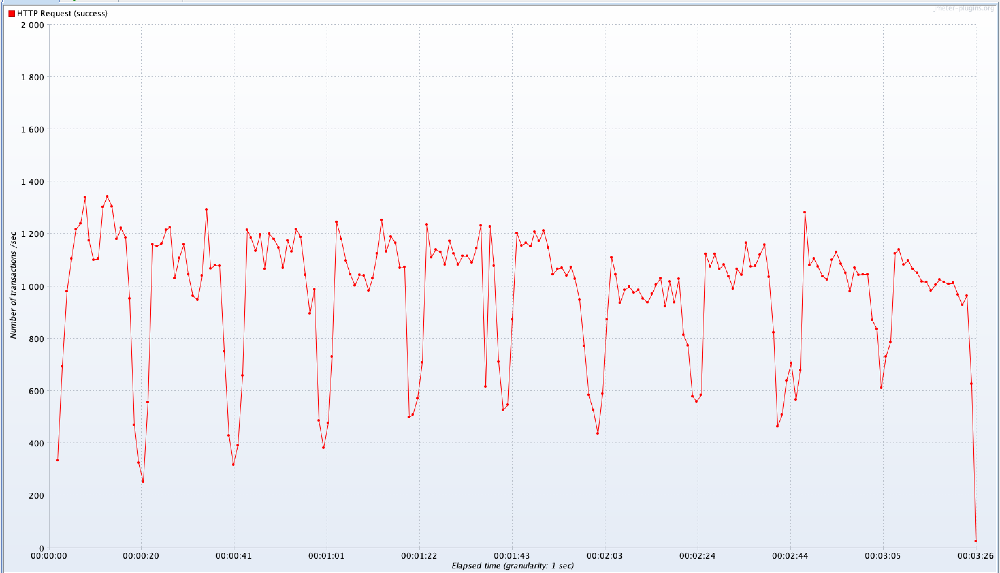

# Spring for Kotlin Example
This project is for studying the spring using by kotlin.

### Required
- docker-compose

### Running project
```shell
docker-compose -f docker-compose.yml up -d
```

### Test
All servers are on localhost.
- Number of Thread: 200
- Ramp-up period(seconds): 1




